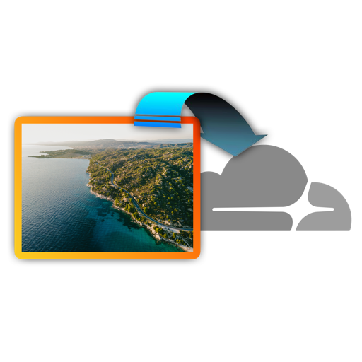

<p align="center">
  
</p>

# cloudflare-images-tools

A monorepo for the **Cloudflare Images** family of tools, a clipboard-first
uploader for Cloudflare Images, plus surfaces for Raycast, Zed (via MCP),
and beyond.

> **Inspired by the [`cloudflare-images-upload`](https://github.com/mcdays94/cloudflare-images-upload-extension) VS Code extension** (also published on
> [Open VSX](https://open-vsx.org/extension/miguelcaetanodias/cloudflare-images-upload)).
> The VS Code extension ships paste / drag-drop directly inside the editor
> via VS Code's `documentPasteEdits` / `documentDropEdits` APIs. This repo
> ports the same upload / compression / dedupe / signing logic to Raycast
> (and, soon, MCP) so the workflow keeps working in editors that don't
> expose those APIs, Zed in particular.

Unofficial. Not affiliated with Cloudflare, Inc.

---

## Why this exists

The original implementation lives in the
[`cloudflare-images-upload`](https://github.com/mcdays94/cloudflare-images-upload-extension)
VS Code / Cursor / Windsurf extension. That works great inside the VS Code
extension model, `documentPasteEdits` and `documentDropEdits` intercept paste
and drag events directly in the editor.

Other editors (Zed, in particular) don't expose those surfaces. The fix is to
move the workflow *next to* the editor instead of *inside* it: a Raycast
extension fired from `⌘ Space` preserves the paste-from-clipboard moment and
works in every app, not just one editor. A future MCP server adds an
agent-callable surface that drops the same logic into Zed, Claude Code,
Cursor, and anything else that speaks MCP.

The VS Code extension stays as-is, this repo is its sibling, not its
replacement. Bug fixes that apply to the shared upload pipeline (compression,
AVIF conversion, signed URLs, metadata templating) can flow between the two
codebases, but neither depends on the other.

## Packages

| Package | Status | Purpose |
|---|---|---|
| [`packages/core`](./packages/core) | ✅ feature-complete for v0.4 | `@mcdays94/cloudflare-images-core`, pure TypeScript: auth, upload, dedupe, signed URLs, compression, metadata, list, delete, variants, URL building. No editor or platform assumptions. |
| [`packages/raycast`](./packages/raycast) | ✅ feature-complete for v0.4 | **Cloudflare Images** Raycast extension. 11 commands; see below. |
| `packages/mcp` | ⬜ not yet | `@mcdays94/cloudflare-images-mcp`, MCP server wrapping the same core. Will add Zed / Claude Code / Cursor support. v1.0 milestone. |

## Raycast extension commands

11 commands, all under "Cloudflare Images" in Raycast root search:

| Command | What it does |
|---|---|
| **Validate Cloudflare Credentials** | Pings the CF Images API to confirm your Account ID, API Token, and Account Hash work. Typed failure messages with actionable next steps. |
| **Upload Clipboard Image** | Reads the clipboard (file ref / image-path text / raw `«class PNGf»` bytes), uploads to CF Images, pastes the URL at cursor. Output format follows preference; optional dropdown argument overrides for the invocation. |
| **Upload Clipboard as Markdown** | Same upload pipeline, format-locked to ``. |
| **Upload Clipboard as HTML** | Same upload pipeline, format-locked to ``. |
| **Upload Clipboard as URL** | Same upload pipeline, format-locked to raw URL. The "just give me the link" path. |
| **Upload Selected File** | Reads Finder selection, uploads each image sequentially, copies newline-joined output to clipboard. Per-file progress, partial-failure tolerant. |
| **Upload Selected File as Markdown** / **HTML** / **URL** | Format-locked variants of the above. |
| **My Cloudflare Images** | Browse, search (by filename + image ID + custom metadata), view metadata in a togglable detail panel, copy in any format, open in browser, delete (with destructive confirm). |
| **Set Default Variant** | Pick the variant Cloudflare URLs use (`/public`, `/hero`, `/blog`, etc.) from a live list fetched from your account. Stored in LocalStorage, overrides the textfield fallback. |

## Preferences

All preferences are stored by Raycast: textfield values in the encrypted SQLite
DB at `~/Library/Application Support/com.raycast.macos/extensions/`, the API
token + manual signing key in macOS Keychain.

| Preference | Type | Default | Notes |
|---|---|---|---|
| Cloudflare Account ID | textfield | - | Required. Find in dashboard URL. |
| Cloudflare API Token | password | - | Required. Needs `Cloudflare Images: Edit`. |
| Cloudflare Account Hash | textfield | - | Required. Public hash in `imagedelivery.net/{hash}/...`. |
| Default Variant (fallback) | textfield | `/public` | Overridden by "Set Default Variant" command. |
| Output Format | dropdown | Markdown | Default for the preference-driven `Upload Clipboard Image` / `Upload Selected File`. |
| Signed URLs | checkbox | off | When on, generates HMAC-signed delivery URLs. |
| Signed URL Expiration (seconds) | textfield | `0` | 0 = no expiry. |
| Manual Signing Key | password | empty | Optional override. Skips API auto-fetch entirely. |
| Attach Metadata to Uploads | checkbox | on | When off, uploads have no metadata. |
| Metadata Template (JSON) | textfield | identifying JSON template | Supports `${fileName}`, `${timestamp}`, `${date}`, `${time}`, `${fileSize}`, `${fileExtension}`, `${surfaceVersion}`, `${workspaceName}`. |
| Compression | checkbox | on | sharp-backed; compresses files exceeding `Max File Size`. |
| Max File Size (MB) | textfield | `10` | Cloudflare hard limit is 10 MB. |
| Compression Quality | textfield | `80` | 1–100. |
| Preserve PNG Format | checkbox | off | Off: PNG → JPEG when compressing. On: stays PNG. |
| AVIF Conversion Format | dropdown | WebP | AVIF inputs converted to this before upload (CF doesn't accept AVIF). |

## Feature parity vs the VS Code extension

| VS Code feature | Raycast status |
|---|---|
| Upload via clipboard paste | ✅ (Upload Clipboard Image + 3 format-locked) |
| Upload via drag-drop | ⛔ Not possible, Raycast can't intercept editor drops |
| Upload via command palette | ✅ Every command appears in Raycast root search |
| Per-language smart formatting | ⚠️ Replaced by `outputFormat` preference + dropdown + 6 format-locked commands |
| Duplicate detection | ✅ SHA-256 dedupe cache in LocalStorage (30-day TTL) |
| Metadata templating (with `${...}` placeholders) | ✅ With same 8 placeholders |
| `addMetadata` toggle | ✅ |
| Signed URLs (auto-fetch key) | ✅ |
| Manual signing key override | ✅ |
| Signed URL expiration | ✅ |
| Sharp-based compression | ✅ |
| Compression quality / max size knobs | ✅ |
| Preserve PNG format | ✅ |
| AVIF → WebP/JPEG/PNG conversion | ✅ |
| Delete-on-removal (watch document) | ⛔ Not possible, Raycast can't watch editor documents. Replaced by My Cloudflare Images list view with delete. |

## Layout

```
cloudflare-images-tools/
  package.json              ← npm workspaces root
  tsconfig.base.json        ← shared strict TS config
  packages/
    core/                   ← @mcdays94/cloudflare-images-core
      src/
        index.ts            ← public exports
        types.ts            ← CloudflareConfig, ImageCacheEntry (imageId), etc.
        hash.ts             ← SHA-256 for dedupe
        compress.ts         ← sharp-based compression + AVIF conversion
        metadata.ts         ← ${...} template variable resolution
        signed-urls.ts      ← HMAC signing, signing-key fetch
        url-builder.ts      ← buildDeliveryUrl (signed-vs-public branch)
        url.ts              ← format URL as markdown / HTML / raw
        upload.ts           ← POST to /accounts/:id/images/v1 (FormData)
        list.ts             ← GET /accounts/:id/images/v2 (cursor-paginated)
        variants.ts         ← GET /accounts/:id/images/v1/variants
        delete.ts           ← DELETE /accounts/:id/images/v1/:image_id
        validate.ts         ← Auth check via /images/v1?per_page=1
      scripts/
        smoke-test.mjs      ← 35 pure-function tests (no network, no mocks)
        api-smoke-test.mjs  ← 6-step live API test against your account
    raycast/                ← Cloudflare Images Raycast extension
      package.json          ← Raycast manifest (11 commands, 14 preferences)
      assets/icon.png       ← 512×512 placeholder (replace before Store submit)
      src/
        validate-credentials.tsx
        upload-clipboard.tsx
        upload-clipboard-markdown.tsx
        upload-clipboard-html.tsx
        upload-clipboard-url.tsx
        upload-finder.tsx
        upload-finder-markdown.tsx
        upload-finder-html.tsx
        upload-finder-url.tsx
        my-images.tsx
        set-default-variant.tsx
        lib/
          config.ts                  ← prefs + parseMetadataTemplate
          cache.ts                   ← LocalStorage dedupe (imageId-keyed)
          signing-key.ts             ← getSigningKey with manual override
          variant.ts                 ← Effective variant resolution
          version.ts                 ← SURFACE_VERSION constant
          upload-clipboard-impl.ts   ← Shared impl for all clipboard commands
          upload-finder-impl.ts      ← Shared impl for all finder commands
```

## Get started

```bash
npm install
npm run typecheck
npm test              # smoke tests for the core package
# Then for Raycast development:
cd packages/raycast
npm run dev           # launches ray develop, registers all 11 commands
```

Open Raycast → "Validate Cloudflare Credentials" command should appear under
"Cloudflare Images". The first time you run it, fill in your Account ID,
API Token, and Account Hash via Raycast preferences (`⌘ ,`). Then it pings
the CF Images API and shows a success / failure page with actions.

## Preferences are persisted by Raycast, not by us

Once you fill them in once via `⌘ ,`, your **Account ID**, **API Token**, and
**Account Hash** are stored by Raycast itself:

- The `password`-type fields (`apiToken`, `manualSigningKey`) live in the
  **macOS Keychain**.
- The other twelve preferences live in Raycast's **encrypted SQLite database**
  at `~/Library/Application Support/com.raycast.macos/extensions/`.

They survive `ray develop` restarts, Raycast app restarts, Mac reboots, and
the future jump from dev to a published Raycast Store release. You don't need
to re-enter them every time you rebuild.

## License

MIT. See [`LICENSE`](./LICENSE).
